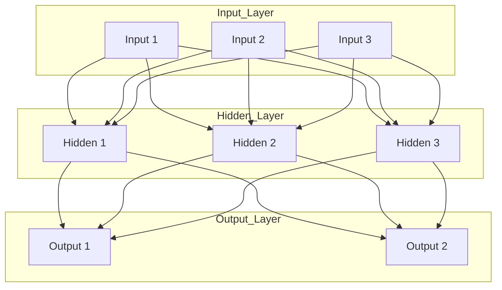

Early Neural Networks and Backpropagation (1980s):

The concept of artificial neural networks (ANNs) dates back to the mid-20th century. Early models like Frank Rosenblatt’s perceptron (1958) could learn simple patterns, but they were limited in scope. In 1969, Marvin Minsky and Seymour Papert published Perceptrons, highlighting that single-layer networks can only learn linearly separable functions, which caused a decline in neural network research in the 1970s​
[`techttarget`](https://www.techtarget.com/whatis/feature/History-and-evolution-of-machine-learning-A-timeline#:~:text=for%20deep%20learning)
. The field rebounded in the 1980s with the introduction of the backpropagation algorithm (pioneered by Rumelhart, Hinton, Williams, and others). Backpropagation enabled efficient training of multi-layer networks (i.e. networks with “hidden” layers), an advancement over the single-layer perceptron and a foundational breakthrough for deep learning​
. This meant ANNs could now learn much more complex mappings from inputs to outputs. However, training these early networks was computationally expensive and often limited by the hardware and data available at the time, so practical impact remained modest until later.

Recurrent Neural Networks and Long-Term Dependencies (1990s)

As researchers explored new architectures, they developed Recurrent Neural Networks ([`RNNs`](https://arxiv.org/abs/1912.05911)) to handle sequential data (like time series and language). RNNs introduce feedback loops so that past outputs can influence future inputs, giving the network a form of memory. In theory this allowed modeling long-term dependencies, but in practice RNNs were very hard to train on long sequences due to the vanishing gradient problem: as errors were back-propagated through many time steps, the gradient values would shrink exponentially, preventing the network from learning long-range correlations​. In the mid-1990s, this limitation was addressed by the invention of the Long Short-Term Memory (LSTM) network (Hochreiter & Schmidhuber, 1997). LSTM introduced gating mechanisms that let the network decide what to keep or forget, enabling it to preserve information over hundreds or thousands of time steps​. This was a major breakthrough for sequence learning – LSTMs overcame vanishing gradients and soon “set accuracy records in multiple application domains”, becoming the default RNN architecture for tasks like speech recognition​
[`Wikipedia`](https://en.wikipedia.org/wiki/History_of_artificial_neural_networks#Recurrent_network_architectures#:~:text=Sepp%20Hochreiter%20%27s%20diploma%20thesis,paths%20that%20require%20memories%20of)
. Thanks to LSTM (and later, the simplified GRU variant), RNNs in the 2000s could learn long-term patterns in text, audio, and other sequence data that vanilla RNNs could not.

Convolutional Neural Networks and the Deep Learning Boom (2010s)

Early vs. modern convolutional networks: The diagram compares the 1990s LeNet-5 CNN (left) to the deeper 2012 AlexNet CNN (right), illustrating how neural networks grew in depth and complexity as more data and compute became available​
[`Wikipedia`](https://en.wikipedia.org/wiki/AlexNet#:~:text=While%20AlexNet%20and%20LeNet%20share,18)
. Convolutional Neural Networks ([`CNNs`](https://arxiv.org/abs/1511.08458))  were designed to process grid-like data such as images. Inspired by the human visual cortex, CNNs use layers of convolution filters to automatically learn spatial hierarchies of features (edges, shapes, objects) from images. Early CNN work by Yann LeCun in the late 1980s demonstrated that neural nets could recognize handwritten characters (e.g. zip code digits) with high accuracy​. LeCun’s LeNet-5 (1998) is a landmark example, successfully reading handwritten digits. Despite these successes, throughout the 1990s and early 2000s neural networks often failed to outperform more hand-crafted approaches (like SVMs or decision trees) on complex tasks, and many in the research community were skeptical​. Two factors changed this: data and hardware. By the 2010s, much larger labeled datasets became available (e.g. the ImageNet database of millions of images), and graphics processing units (GPUs) allowed the training of bigger, deeper networks. In 2012, a deep CNN known as AlexNet (developed by Hinton, Krizhevsky, and Sutskever) won the ImageNet competition by a huge margin, beating the previous state-of-the-art in image recognition by a significant leap​. This triumph vividly showed the power of deep learning and “triggered an explosion of deep learning research and implementation” across the industry​
[`techttarget`](https://www.techtarget.com/whatis/feature/History-and-evolution-of-machine-learning-A-timeline#:~:text=2012)
. CNNs rapidly became the dominant approach for computer vision tasks – from object detection to facial recognition – and were soon achieving superhuman performance in some domains (e.g. recognizing traffic signs or diagnosing medical images). The success of AlexNet and subsequent CNN models (VGG, GoogLeNet, ResNet, etc.) marks the beginning of the modern deep learning era in AI.

Generative Adversarial Networks (2014) – Generative AI Breakthrough

As neural networks grew more capable, researchers began exploring models that generate new data rather than just recognize it. A milestone in this area was the introduction of Generative Adversarial Networks (GANs) in 2014 by Ian Goodfellow and colleagues​
[`GAN`](https://arxiv.org/abs/1406.2661)
. A GAN consists of two competing neural networks: a generator that tries to create realistic fake data (e.g. images that look like real photographs), and a discriminator that tries to tell apart the generator’s fakes from real data. The two networks are trained in tandem in a “adversarial” game: the generator improves at fooling the discriminator, and the discriminator gets better at spotting fakes. This clever setup enabled GANs to produce incredibly realistic images, noises, and other data. Over the 2014–2018 period, GANs became state-of-the-art in generative modeling​
[`Wikipedia`](https://en.wikipedia.org/wiki/Generative_adversarial_network)
 – for example, NVIDIA’s StyleGAN (2018) could generate photorealistic human faces that don’t belong to any real person​
[`research.nvidia`](https://research.nvidia.com/publication/2022-05_stylegan-nada-clip-guided-domain-adaptation-image-generators)
. Researchers also built variants for tasks like image-to-image translation (e.g. turning sketches into color images) and video generation. The advent of GANs was significant because it showed neural networks could create – not just classify – complex data, opening the door to today’s generative AI applications (art creation, deepfakes, data augmentation, etc.). GANs did have their challenges (such as training instabilities like mode collapse), but they undeniably pushed the boundaries of what AI could do, and spurred a lot of excitement about generative AI.

Transformers – “Attention Is All You Need” (2017)

In 2017, a single paper fundamentally altered the course of AI research. Google researchers Ashish Vaswani et al. published “Attention Is All You Need,” which introduced the Transformer architecture​
[`Wikipedia`](https://en.wikipedia.org/wiki/Attention_Is_All_You_Need#:~:text=,was%20on%20improving%20%2060)
. The Transformer was a radical departure from previous sequence models (like RNNs) because it did not use any recurrent loops or convolutions for processing sequences. Instead, it relied entirely on a mechanism called self-attention that allowed the model to weigh the influence of different input elements on each other. In essence, a Transformer can look at an entire sequence (say, a sentence) and learn which words or parts of the sequence are relevant to each other, and it can do this for all parts of the sequence in parallel​
[`Transformers`](https://arxiv.org/abs/1706.03762)
. By removing the sequential nature of RNNs, Transformers achieved two huge benefits: they preserved long-range context much more effectively (since even distant elements can directly attend to each other), and they could be parallelized during training, making it feasible to train very large models on GPUs or TPUs​
[`Wikipedia`](https://en.wikipedia.org/wiki/Attention_Is_All_You_Need#:~:text=The%20paper%20is%20most%20well,bigger%20sizes%20to%20be%20trained)
. The 2017 paper focused on machine translation, showing that Transformers outperformed RNN-based translation models and were faster to train​. But the authors correctly anticipated that the approach could be applied much more broadly​. Indeed, the Transformer architecture quickly became the new standard for natural language processing. It was modular (built from repeated self-attention and feed-forward layers) and scaled extremely well with data and compute. Almost overnight, researchers began replacing recurrent networks with Transformers in language tasks. The Transformer is now regarded as a “foundational” architecture in modern AI, forming the backbone of most large-scale models​. With Transformers, the stage was set for an era of unprecedented progress, as they enabled the training of models on unthinkably large datasets and for new capabilities.

Large Language Models and Modern AI Explosion (2018–Present)

The introduction of Transformers in 2017 ushered in a period of accelerating progress in AI. One of the first major fruits of this innovation was the rise of large language models (LLMs) built on the Transformer architecture. In 2018, OpenAI released the first Generative Pre-Trained Transformer model, known as GPT-1, demonstrating that a Transformer trained on massive amounts of text could generate fluent passages of natural language​
[`techttarget`](https://www.techtarget.com/whatis/feature/History-and-evolution-of-machine-learning-A-timeline#:~:text=2018)
. OpenAI’s approach was to pre-train the model on a diverse corpus (so it learned general language patterns) and then fine-tune it on specific tasks – a recipe that proved extremely powerful. The following year, they unveiled GPT-2 (2019), a significantly larger model with about 1.5 billion parameters​
[`Wikipedia`](https://en.wikipedia.org/wiki/GPT-3#:~:text=of%20manually,9)
. GPT-2 showed dramatic improvements in generating coherent and contextually relevant text, to the point of writing entire news articles or stories that were often hard to distinguish from human-written content. In 2020 came GPT-3, which was a quantum leap in scale: 175 billion parameters​ trained on nearly all of the Internet’s text. GPT-3 astonished the world with its ability to perform tasks it was never explicitly trained for (from writing code to answering complex questions) simply by being prompted with a few examples – so-called “few-shot” learning​
[`few-shot`](https://www.ibm.com/think/topics/few-shot-learning#:~:text=Few%2Dshot%20learning%20is%20a,suitable%20training%20data%20is%20scarce.)
. This demonstrated a surprising emergent capability: with enough data and parameters, a Transformer-based model could learn to do a wide range of tasks without specialized training for each one. Other organizations and researchers also quickly adopted Transformers to build their own large models. In late 2018 Google introduced BERT (Bidirectional Encoder Representations from Transformers), which used a Transformer encoder to achieve state-of-the-art results in language understanding tasks. Subsequent models like MegatronLM, T5, XLNet, and PALM pushed the envelope further in various ways (larger sizes, different training objectives, etc.). These models collectively are referred to as large language models, and they began to revolutionize language-based AI across the board – powering translation services, search engines, personal assistants, and more. A key turning point in public awareness was the release of ChatGPT by OpenAI in late 2022. ChatGPT took the GPT-3.5 model and fine-tuned it for conversational interaction, packaging it in an accessible chat interface. Within months, it reached over 100 million users, exposing millions of people to AI-generated text as a useful (and sometimes uncanny) tool in daily life​. Shortly after, in 2023, OpenAI announced GPT-4, a still larger and more advanced model that is multimodal (able to accept text and images as input) and exhibits even more advanced reasoning and understanding capabilities​. The pace at which these Transformer-based systems have improved is often described as exponential. In fact, the period from 2017 to 2025 has seen more rapid AI development than perhaps the entire 30 years prior – a testament to how impactful the Transformer innovation has been. Improved algorithms (the attention-based architectures), orders-of-magnitude more computing power, and unprecedented quantities of training data have together “fueled a revolution” in machine learning, resulting in rapid improvements on many tasks​. Today’s AI models can converse, answer questions, generate images, compose music, and more – achievements that would have been science fiction a decade ago. And this progress shows no sign of slowing down, all tracing back to those key milestones: from the early neural nets and CNNs, to GANs, and especially the game-changing introduction of Transformers in 2017 that truly transformed the evolution of AI.

<!-- Let's break it down: this is possible thanks to [Jekyll Jupyter Notebook plugin](https://github.com/red-data-tools/jekyll-jupyter-notebook) that allows you to embed jupyter notebooks in your posts. It basically calls [`jupyter nbconvert --to html`](https://nbconvert.readthedocs.io/en/latest/usage.html#convert-html) to convert the notebook to an html page and then includes it in the post. Since [Kramdown](https://jekyllrb.com/docs/configuration/markdown/) is the default Markdown renderer for Jekyll, we need to surround the call to the plugin with the [::nomarkdown](https://kramdown.gettalong.org/syntax.html#extensions) tag so that it stops processing this part with Kramdown and outputs the content as-is.

The plugin takes as input the path to the notebook, but it assumes the file exists. If you want to check if the file exists before calling the plugin, you can use the `file_exists` filter. This avoids getting a 404 error from the plugin and ending up displaying the main page inside of it instead. If the file does not exist, you can output a message to the user. The code displayed above outputs the following:

{::nomarkdown}






Sorry, the notebook you are looking for does not exist.


{:/nomarkdown}

Note that the jupyter notebook supports both light and dark themes. -->
